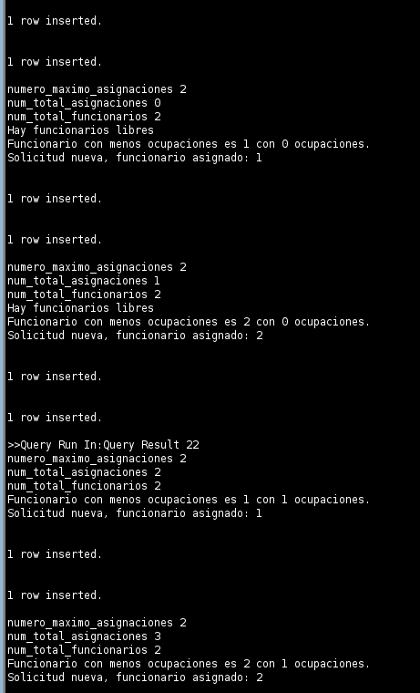

# Taller diseño lógico PL/SQL

# Solución

##  Esquema

El esquema propuesto es el siguiente.


## [Procedimientos](ddl.sql):

Los procedimientos para resolver el problema son:

* obtener_funcionario_disponible:

    * Obtiene un funcionario disponible para asignar a una solicitud pendiente.

    * Verifica el número máximo de asignaciones permitidas configurado en la tabla parametros_sistema.

    * Comprueba el número total de asignaciones activas en la tabla asignaciones.

    * Verifica el número total de funcionarios disponibles en la tabla funcionarios.

    * Si no hay funcionarios disponibles, se genera una excepción NO_DATA_FOUND.

    * Si hay funcionarios sin asignaciones, se selecciona uno aleatoriamente para asignarlo a la solicitud pendiente.

    * Si todavía hay funcionarios con asignaciones por debajo del máximo permitido, se selecciona el funcionario con menos asignaciones para asignarlo a la solicitud pendiente.

* asignar_funcionario:

    * Asigna un funcionario a una solicitud específica.
    
    * Verifica si la solicitud ya se encuentra pendiente en la tabla asignaciones.
    
    * Si la solicitud está pendiente, actualiza los datos de la asignación, incluyendo el funcionario asignado y la fecha de asignación.
    
    * Si la solicitud es nueva, inserta una nueva fila en la tabla asignaciones con el funcionario asignado y la fecha de asignación.
    
    * Si no hay funcionarios disponibles, se inserta una nueva fila en la tabla asignaciones con el estado pendiente y sin un funcionario asignado.


## [Triggers](ddl.sql):


* Trigger asignacion_automatica_trig:

    
    * Este trigger se dispara antes de insertar una nueva fila en la tabla asignaciones.
     
    * Su propósito principal es realizar la asignación automática de un funcionario a la solicitud pendiente.
     
    * El trigger invoca el procedimiento obtener_funcionario_disponible para obtener un funcionario disponible.
     
    * Luego, llama al procedimiento asignar_funcionario para asignar el funcionario a la solicitud pendiente.
     
    * Si no se puede asignar un funcionario disponible, el trigger captura la excepción y deja la asignación en estado pendiente sin asignar un funcionario.


* Trigger asignacion_auto_update_trig:

    * Este trigger se dispara después de actualizar una fila en la tabla asignaciones.

    * Su objetivo principal es verificar si la solicitud se ha marcado como completada y, en ese caso, buscar la solicitud más antigua pendiente y asignarla a un funcionario disponible.

    * El trigger realiza una consulta para encontrar la solicitud más antigua pendiente.

    * Luego, invoca el procedimiento obtener_funcionario_disponible para obtener un funcionario disponible.

    * Finalmente, llama al procedimiento asignar_funcionario para asignar el funcionario a la solicitud pendiente más antigua.

# Pruebas 


# Pruebas asignación automática

Ejecutar los inserts en [inserts.sql](inserts.sql) para verificar el funcionamiento.

```sql
-- Inserts para tabla solicitudes
INSERT INTO solicitudes VALUES (1, 1, 'Solicitud arabelo', SYSDATE);
INSERT INTO solicitudes_creacion_modif VALUES (1, 1);

INSERT INTO solicitudes VALUES (2, 2, 'E-commerce solicitud Bourbon', SYSDATE);
INSERT INTO solicitudes_creacion_modif VALUES (2, 2);

-- Cada uno de los 2 funcionarios debería tener asignada 1 solicitud

select * from asignaciones; 

/* 
Ahora se le debe asignar más de una solicitud a cada funcionario, de tal forma que 
quede un funcionario con el máximo número de asignaciones.
*/
INSERT INTO solicitudes VALUES (3, 3, 'consultoria kaggle Carlos', SYSDATE);
INSERT INTO solicitudes_creacion_modif VALUES (3, 3);

INSERT INTO solicitudes VALUES (4, 4, 'consultoria kaggle Dorian', SYSDATE);
INSERT INTO solicitudes_creacion_modif VALUES (4, 1);

select * from asignaciones; 
```




```sql
-- Ahora con una nueva solicitud, esta debería quedar pendiente (con estado 1)
INSERT INTO solicitudes VALUES (5, 5, 'consultoria kaggle Erling', SYSDATE);
INSERT INTO solicitudes_creacion_modif VALUES (5, 1);

select * from asignaciones; 
```


# Pruebas asignación masiva

```sql
-- Ahora, supongamos que ya se completó la primera solicitud, y por tanto, el 
-- funcionario 1 puede tomar otra solicitud
update asignaciones 
    set estado_id = 3
where solicitud_id = 1;

select * from asignaciones; 

-- Probar asignación masiva, solo actualizará la solicitud 5,
-- aisgnándola al funcionario que esté libre
begin
    DBMS_OUTPUT.PUT_LINE('Probando asignación masiva ');
    asignacion_masiva_funcionarios();
end;
```


Y el job se ejecuta:


# Enunciado

Una empresa de desarrollo tecnológico ha decidido implementar un sistema para la gestión de
solicitudes y reclamos. Se deben manejar los siguientes procesos

## Registro

Un cliente puede registrar una solicitud de creación o modificación del producto implementado,
que puede ser de tipo Consultoría SAP, Desarrollo de e-commerce o Consultoría en analítica de
datos.

Para solicitar el producto, el cliente debe estar registrado en la base de datos previamente. La solicitud de creación se compone de: tipo de producto que desea y la cédula del cliente. También se permitirá ingresar una observación para suministrar información adicional.
El cliente también puede solicitar soporte para un producto que ya ha adquirido. En este caso, puede reportar que tiene un daño en el funcionamiento del sistema. El tipo de soporte puede ser Infraestructura, Bugs en el sistema o Facturación.

Para el registro del soporte el sistema solicitará la cédula del cliente, el producto sobre el cual desea registrar el daño, el tipo de anomalía (que se podrá seleccionar de una lista) y la  descripción del problema. Por ejemplo, si un cliente está inconforme con la facturación de sus servicios, puede registrar una solicitud de tipo Facturación indicando que ha habido un error en  el cobro. El sistema solicitará la cédula del cliente, el producto sobre el cual desea registrar el reclamo y una descripción del problema.


## Asignación

Una vez registrada una solicitud el sistema deberá asignar automáticamente (con un trigger) a un funcionario para que la evalúe y tome una decisión al respecto. Para esto, el sistema debe tener un algoritmo que balancea la carga de los funcionarios. Por ejemplo, si un funcionario
tiene más de tres (3) solicitudes acumuladas, el sistema no debería asignarle más solicitudes  hasta que no libere carga. La cantidad máxima de solicitudes que puede tener un funcionario es un parámetro configurable en el sistema (ver Consideraciones adicionales). En este caso, la
solicitud queda en estado “pendiente”. En el momento de asignar, se debe guardar el funcionario asignado, la fecha de asignación y cambiar el estado a "asignada". Si ocurre un error durante la asignación de una solicitud, ésta quedará en estado pendiente y podrá ser
asignada después de manera manual o masiva.

Para la asignación masiva, se deberá definir un proceso programado que evalúe las solicitudes (incluyendo solicitudes de soporte) que tenga más de cierto tiempo en estado Pendiente para tratar de asignarlas. Este tiempo será un valor parametrizado en la base de datos (ver consideraciones adicionales). Si ocurre un error durante la atención automática de una solicitud, ésta se dejará en estado pendiente y se procesa la siguiente solicitud.

## Consideraciones adicionales

### Parámetros del sistema.

Usted debe crear una tabla de parámetros para configurar constantes o parámetros que puedan ser cambiados en tiempo de ejecución sin necesidad de modificar el código de la aplicación. Dicha tabla debe, como mínimo, tener un código del parámetro, un nombre y un valor.

